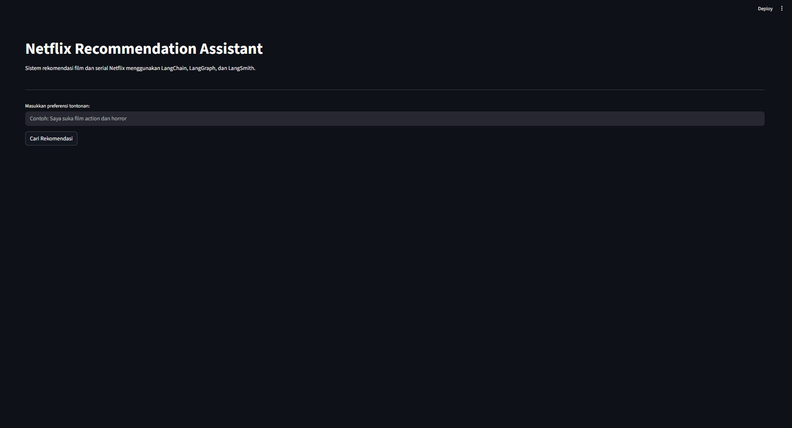
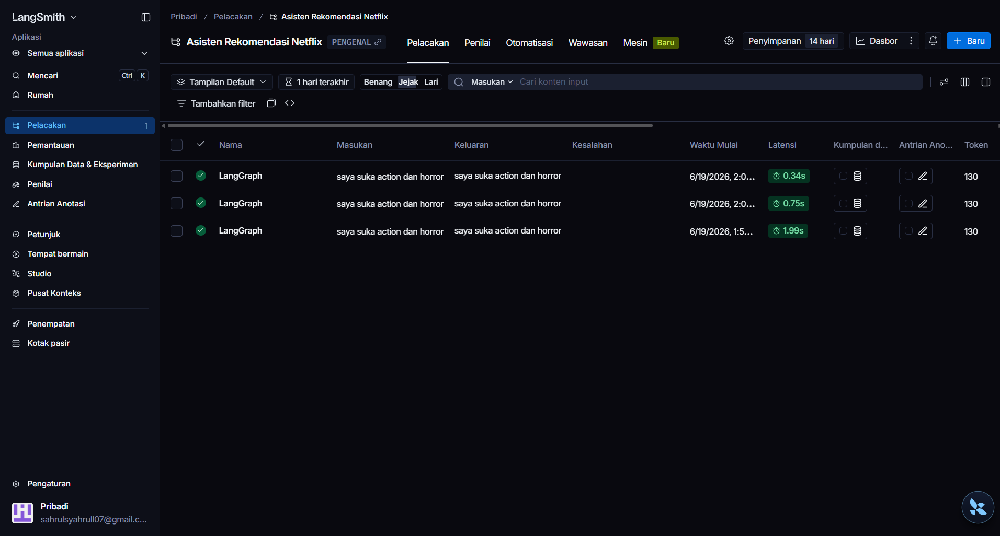

# Netflix Recommendation Assistant

Netflix Recommendation Assistant merupakan aplikasi rekomendasi film berbasis Artificial Intelligence yang memanfaatkan teknologi Large Language Model (LLM) untuk memahami preferensi pengguna dan memberikan rekomendasi film yang relevan berdasarkan dataset Netflix.

Aplikasi ini dibangun menggunakan LangChain, LangGraph, dan LangSmith sebagai komponen utama dalam pengembangan workflow AI, serta menggunakan Groq LLM sebagai model bahasa dan Streamlit sebagai antarmuka pengguna.

---

## Deskripsi Proyek

Sistem menerima masukan berupa preferensi film yang ditulis dalam bahasa alami, misalnya:

> Saya suka film action dan horror

Selanjutnya sistem akan:

1. Mengekstrak genre film menggunakan LLM.
2. Mencocokkan genre dengan data film pada dataset Netflix.
3. Menampilkan daftar rekomendasi film yang sesuai.
4. Mencatat seluruh proses eksekusi menggunakan LangSmith untuk kebutuhan monitoring dan debugging.

---

## Fitur Utama

- Rekomendasi film berdasarkan preferensi pengguna
- Pemrosesan bahasa alami menggunakan LLM
- Workflow berbasis LangGraph
- Monitoring dan tracing menggunakan LangSmith
- Dataset Netflix dalam format CSV
- Antarmuka interaktif berbasis Streamlit

---

## Teknologi yang Digunakan

| Teknologi  | Kegunaan                       |
|------------|-------------------------------|
| Python     | Bahasa pemrograman utama       |
| Pandas     | Pengolahan dataset             |
| Streamlit  | Antarmuka pengguna             |
| LangChain  | Pengelolaan prompt dan LLM     |
| LangGraph  | Workflow orchestration         |
| LangSmith  | Monitoring dan tracing         |
| Groq API   | Penyedia Large Language Model  |

---

## Struktur Proyek

```
NETFLIX_RECOMENDATION-ASSISTEN_UAS_PRAKTIKUM_NLP/
│
├── app.py
├── workflow.py
├── requirements.txt
├── README.md
├── .env.example
│
├── chains/
│   ├── __init__.py
│   └── recommendation_chain.py
│
├── utils/
│   ├── __init__.py
│   └── data_loader.py
│
├── data/
│   └── netflix_titles.csv
│
└── screenshots/
    ├── home.png
    └── langsmith-trace.png
```

---

## Alur Sistem

```
User Input
     │
     ▼
Genre Extraction (LangChain + Groq)
     │
     ▼
Movie Search (Dataset Netflix)
     │
     ▼
Recommendation Result
     │
     ▼
LangSmith Tracing
```

---

## Implementasi LangGraph

Workflow aplikasi dibangun menggunakan LangGraph dengan dua node utama:

```
START
  │
  ▼
genre_extraction
  │
  ▼
movie_search
  │
  ▼
END
```

### 1. Genre Extraction

Node ini bertugas mengekstrak genre film berdasarkan preferensi pengguna menggunakan Large Language Model.

Input:
```
Saya suka film action dan horror
```

Output:
```
Action
Horror
```

### 2. Movie Search

Node ini melakukan pencarian film pada dataset Netflix berdasarkan genre yang telah diekstrak sebelumnya.

Contoh hasil:
```
Jaws 3
Deep Blue Sea
Blood Red Sky
```

---

## Dataset

Dataset yang digunakan adalah **Netflix Movies and TV Shows Dataset** yang berisi informasi film dan serial Netflix.

Kolom yang digunakan dalam proyek ini:

| Kolom       | Keterangan                        |
|-------------|----------------------------------|
| title       | Judul film/serial                 |
| type        | Tipe konten (Movie/TV Show)       |
| listed_in   | Genre film                        |
| description | Deskripsi singkat film            |

---

## Dokumentasi

### Tampilan Aplikasi



Halaman utama aplikasi Streamlit untuk memasukkan preferensi pengguna dan menampilkan rekomendasi film.

### LangSmith Trace



Hasil tracing workflow pada LangSmith untuk memantau proses eksekusi LangGraph dan LangChain.

---

## Instalasi

### 1. Clone Repository

```bash
git clone https://github.com/sahrulefd/NETFLIX_RECOMENDATION-ASSISTEN_UAS_PRAKTIKUM_NLP.git
cd NETFLIX_RECOMENDATION-ASSISTEN_UAS_PRAKTIKUM_NLP
```

### 2. Install Dependency

```bash
pip install -r requirements.txt
```

### 3. Konfigurasi Environment Variable

Buat file `.env` pada root project berdasarkan `.env.example`:

```env
GROQ_API_KEY=your_groq_api_key
LANGCHAIN_API_KEY=your_langsmith_api_key
LANGCHAIN_TRACING_V2=true
LANGCHAIN_PROJECT=Netflix-Recommendation-Assistant
```

### 4. Jalankan Aplikasi

```bash
streamlit run app.py
```

Akses aplikasi melalui browser di: `http://localhost:8501`

---

## Contoh Penggunaan

**Input:**
```
Saya suka film action dan horror
```

**Output:**
```
1. Jaws 3
2. Deep Blue Sea
3. Blood Red Sky
4. Jaws: The Revenge
5. Krishna Cottage
```

---

## Implementasi LangSmith

LangSmith digunakan untuk monitoring dan tracing terhadap workflow yang dijalankan. Informasi yang dapat dipantau:

- Input pengguna
- Output sistem
- Node yang dieksekusi
- Durasi proses
- Penggunaan token
- Proses debugging

Contoh trace:
```
LangGraph
├── genre_extraction
│   └── ChatGroq (llama-3.3-70b-versatile)
└── movie_search
```

---

## Hasil Pengujian

| Skenario Pengujian | Status   |
|--------------------|----------|
| Action + Horror    | Berhasil |
| Romantic Movies    | Berhasil |
| Sci-Fi Movies      | Berhasil |
| Comedy Movies      | Berhasil |

Sistem mampu memberikan rekomendasi film yang relevan sesuai preferensi pengguna yang dituliskan dalam bahasa alami.

---

## Kesimpulan

Netflix Recommendation Assistant berhasil mengimplementasikan teknologi:

- **LangChain** untuk ekstraksi genre menggunakan LLM.
- **LangGraph** untuk mengelola workflow aplikasi.
- **LangSmith** untuk monitoring dan tracing proses eksekusi.
- **Dataset Netflix** sebagai sumber data rekomendasi film.

---

## Pengembang

| | |
|---|---|
| **Nama** | Sahrul Efendi |
| **Mata Kuliah** | Praktikum Artificial Intelligence |
| **Topik Proyek** | Sistem Rekomendasi Film Netflix Menggunakan LangChain, LangGraph, dan LangSmith |